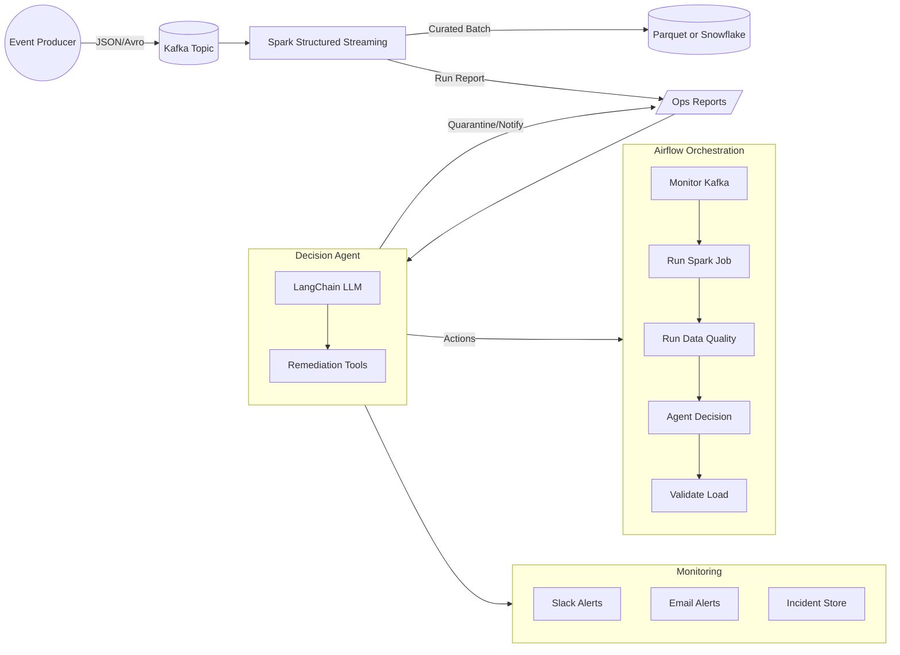

# Autonomous Data Pipeline Orchestrator

A self-healing data pipeline that monitors ingestion jobs (Kafka → Spark → Snowflake), detects anomalies (schema drift, late arrivals, failed jobs), and autonomously decides remediation strategies using agentic AI.

## 🎯 Why This Matters

Modern data engineering teams spend 60-70% of their time on operational issues rather than building new features. This autonomous pipeline reduces operational overhead by:

- **Self-monitoring**: Continuously tracks pipeline health and data quality
- **Intelligent detection**: Identifies schema drift, late arrivals, and data quality issues
- **Autonomous remediation**: Uses LLM-powered agents to make remediation decisions
- **Proactive alerting**: Escalates only when human intervention is truly needed
- **Full observability**: Complete audit trail of all decisions and actions

## 🏗️ Architecture



## 🚀 Quick Start

### Prerequisites

- Docker & Docker Compose
- 8GB+ RAM recommended
- 10GB+ free disk space

### 1. Clone and Setup

```bash
git clone <repository>
cd autonomous-data-pipeline
make setup
```

### 2. Configure Environment

```bash
# Edit .env file with your settings
cp .env.example .env
vim .env  # Configure Kafka, Snowflake, LLM, and alerting settings
```

### 3. Start the Pipeline

```bash
# Start all services
make up

# Monitor startup
make monitor
```

### 4. Access UIs

- **Airflow**: http://localhost:8080 (airflow/airflow)
- **Kafka UI**: http://localhost:8080 (Kafka monitoring)
- **Spark Master**: http://localhost:8082
- **MailHog**: http://localhost:8025 (email testing)

### 5. Trigger Pipeline

```bash
# Trigger the main DAG
make airflow-trigger

# Or use Airflow UI to enable and trigger autonomous_data_pipeline DAG
```

## 📊 Data Flow

1. **Event Generation**: Producer generates customer events with configurable anomalies
2. **Stream Processing**: Spark consumes from Kafka, applies transformations
3. **Quality Checks**: Great Expectations validates data quality
4. **Autonomous Decision**: LangChain agent analyzes metrics and decides actions
5. **Remediation**: Agent executes tools (retrigger, remap, quarantine, notify)
6. **Monitoring**: Full observability with alerts and incident tracking

## 🧠 Decision Matrix

The agent makes decisions based on these conditions:

| Condition | Threshold | Action |
|-----------|-----------|--------|
| Schema drift (additive) | New nullable fields | Auto-remap schema |
| Schema drift (breaking) | Type changes, required fields | Quarantine + Escalate |
| Late arrivals | < 15% of records | Retrigger next batch |
| Late arrivals | > 15% of records | Escalate investigation |
| DQ failures | < 5% failure rate | Log and continue |
| DQ failures (localized) | Specific country/plan | Quarantine affected records |
| DQ failures | > 5% failure rate | Escalate incident |
| Repeated failures | 3+ consecutive | Escalate with context |

## 🛠️ Configuration

### Environment Variables

```bash
# Kafka Configuration
KAFKA_BROKER=broker:29092
KAFKA_TOPIC=customers

# Snowflake (optional - uses Parquet if not configured)
SNOWFLAKE_ACCOUNT=your-account
SNOWFLAKE_USER=your-user
SNOWFLAKE_PASSWORD=your-password
SNOWFLAKE_WAREHOUSE=your-warehouse
SNOWFLAKE_DATABASE=your-database
SNOWFLAKE_SCHEMA=PUBLIC
SNOWFLAKE_TABLE=RAW_CUSTOMERS

# Output Configuration
SINK_MODE=PARQUET  # or SNOWFLAKE
PARQUET_OUT=/data/out/parquet

# LLM Configuration
LLM_PROVIDER=ollama  # or openai
OLLAMA_MODEL=llama3.1
OPENAI_API_KEY=your-key

# Alerting
ALERT_SLACK_WEBHOOK_URL=your-webhook
ALERT_EMAIL=your-email@domain.com
```

### Snowflake Configuration

For Snowflake integration, configure the Spark connector:

```python
snowflake_options = {
    "sfUrl": f"{account}.snowflakecomputing.com",
    "sfUser": user,
    "sfPassword": password,
    "sfDatabase": database,
    "sfSchema": schema,
    "sfWarehouse": warehouse,
    "sfRole": role
}

df.write \
    .format("snowflake") \
    .options(**snowflake_options) \
    .option("dbtable", table_name) \
    .mode("append") \
    .save()
```

Required JARs (already included in Spark configuration):
- `net.snowflake:snowflake-jdbc:3.13.30`
- `net.snowflake:spark-snowflake_2.12:2.11.0-spark_3.4`

### Data Quality Rules

Modify `airflow/include/dq_rules.yml` to customize validation rules:

```yaml
business_rules:
  customer_data_quality:
    expectations:
      - expectation_type: "expect_column_values_to_not_be_null"
        column: "id"
      - expectation_type: "expect_column_values_to_match_regex"
        column: "email"
        regex: "^[a-zA-Z0-9._%+-]+@[a-zA-Z0-9.-]+\\.[a-zA-Z]{2,}$"
```

## 🧪 Testing

```bash
# Run all tests
make test

# Run specific test suites
make test-agent      # Agent decision logic
make test-dq         # Data quality validations
make test-spark      # Spark transformations

# Run with coverage
make test-coverage

# Lint and format
make fmt lint
```

## 🔧 Development

### Local Development Setup

```bash
# Complete development setup
make dev-setup

# Install dependencies
make install-deps

# Format and lint code
make fmt lint

# Run CI pipeline locally
make ci-test
```

### Adding New Decision Logic

1. **Update Agent Logic** (`agent/decision_agent.py`):
```python
def _rule_based_decision(self, context: DecisionContext) -> DecisionResult:
    # Add your custom decision logic
    if context.run_report.get('custom_metric') > threshold:
        # Execute custom remediation
        pass
```

2. **Add New Tools** (`agent/tools.py`):
```python
def custom_remediation(self, **kwargs) -> ToolResult:
    # Implement custom remediation logic
    return ToolResult(success=True, message="Custom action completed")
```

3. **Update Tests** (`tests/test_agent.py`):
```python
def test_custom_scenario(self):
    # Test your new decision logic
    pass
```

### Extending Data Sources

1. **Add Kafka Topic**: Update producer and Spark job for new topics
2. **New Data Format**: Extend schema in `kafka/schemas/`
3. **Additional Sinks**: Add sink implementations in Spark job

## 📈 Monitoring & Observability

### Key Metrics

- **Pipeline Health**: Success rate, processing latency, throughput
- **Data Quality**: Validation pass rate, schema drift frequency
- **Agent Performance**: Decision accuracy, remediation success rate
- **Resource Utilization**: CPU, memory, storage usage

### Dashboards

- **Airflow**: Pipeline execution history and task status
- **Kafka UI**: Topic lag, partition health, consumer groups
- **Spark UI**: Job execution, stage details, resource usage
- **Custom**: Agent decisions and remediation actions

### Alerting Channels

1. **Slack**: Real-time notifications with severity levels
2. **Email**: Detailed incident reports and summaries
3. **Incident Store**: Historical tracking and trend analysis

## 🚨 Troubleshooting

### Common Issues

**Services won't start:**
```bash
# Check Docker resources
make debug

# Check service logs
make logs

# Restart with clean state
make down-v && make up
```

**Kafka connectivity issues:**
```bash
# Check Kafka cluster health
make logs-kafka

# Verify topic creation
docker-compose exec broker kafka-topics --list --bootstrap-server localhost:9092
```

**Airflow DAG not appearing:**
```bash
# Check DAG syntax
python airflow/dags/pipeline_dag.py

# Check Airflow logs
make logs-airflow

# Restart Airflow scheduler
docker-compose restart airflow-scheduler
```

**Spark job failures:**
```bash
# Check Spark logs
make logs-spark

# Submit job manually for debugging
make spark-submit

# Check resource allocation
docker stats
```

**Agent decision issues:**
```bash
# Check LLM connectivity (Ollama)
curl http://localhost:11434/api/version

# Run agent in debug mode
python agent/decision_agent.py --run-report /data/ops/run_report.json --ge-results /data/ops/ge_results.json

# Check agent logs
tail -f data/ops/decision_log.jsonl
```

### Performance Tuning

**Memory Issues:**
- Increase Docker memory allocation (8GB+ recommended)
- Adjust Spark executor memory in `spark-defaults.conf`
- Reduce parallelism for resource-constrained environments

**Storage Issues:**
- Enable data cleanup with `make reset-data` (WARNING: destroys data)
- Configure shorter data retention periods
- Use external storage for Parquet output

**Network Issues:**
- Check port conflicts (8080, 9092, 8081, 8082)
- Verify Docker network connectivity
- Use `make status` to check service health

## 🔐 Security Considerations

- **Secrets Management**: Use external secret stores for production
- **Network Security**: Configure firewalls and VPNs appropriately
- **Data Encryption**: Enable encryption at rest and in transit
- **Access Control**: Implement RBAC for Airflow and Kafka
- **Audit Logging**: All agent decisions are logged for compliance

## 🚀 Production Deployment

### Infrastructure Requirements

- **Compute**: 4+ CPU cores, 16GB+ RAM per node
- **Storage**: SSD storage for Kafka logs and checkpoints
- **Network**: Low-latency connectivity between components
- **Monitoring**: Prometheus + Grafana for metrics collection

### Deployment Options

1. **Kubernetes**: Use Helm charts for container orchestration
2. **Cloud Managed**: AWS MSK, Azure Event Hubs, GCP Dataflow
3. **Hybrid**: Managed Kafka + self-hosted processing

### Production Checklist

- [ ] Configure external secret management
- [ ] Set up monitoring and alerting
- [ ] Implement backup and disaster recovery
- [ ] Configure log aggregation
- [ ] Set up CI/CD pipelines
- [ ] Perform load testing
- [ ] Document runbooks and procedures

## 🔄 Extensibility

### Adding New Components

1. **Data Sources**: Extend for databases, APIs, file systems
2. **Processing Engines**: Add Flink, Databricks, or custom processors
3. **Storage Systems**: Support for more databases and data lakes
4. **ML Integration**: Add model inference and drift detection
5. **Orchestrators**: Support for Prefect, Dagster, or custom schedulers

### Integration Patterns

- **Event-Driven**: React to external events and triggers
- **API-First**: Expose REST APIs for external integration
- **Plugin Architecture**: Modular components for easy extension
- **Configuration-Driven**: Declarative pipeline definitions

## 🤝 Contributing

1. Fork the repository
2. Create a feature branch: `git checkout -b feature/new-capability`
3. Make changes and add tests
4. Run the CI pipeline: `make ci-test`
5. Commit with clear messages
6. Submit a pull request

## 📄 License

MIT License - see LICENSE file for details.

## 🙏 Acknowledgments

- Apache Airflow, Kafka, and Spark communities
- LangChain for the agent framework
- Great Expectations for data quality
- Docker and containerization ecosystem

## 📞 Support

- **Issues**: GitHub Issues for bug reports and feature requests
- **Discussions**: GitHub Discussions for questions and ideas
- **Documentation**: Wiki for detailed guides and examples

---

**Built with ❤️ for the data engineering community**